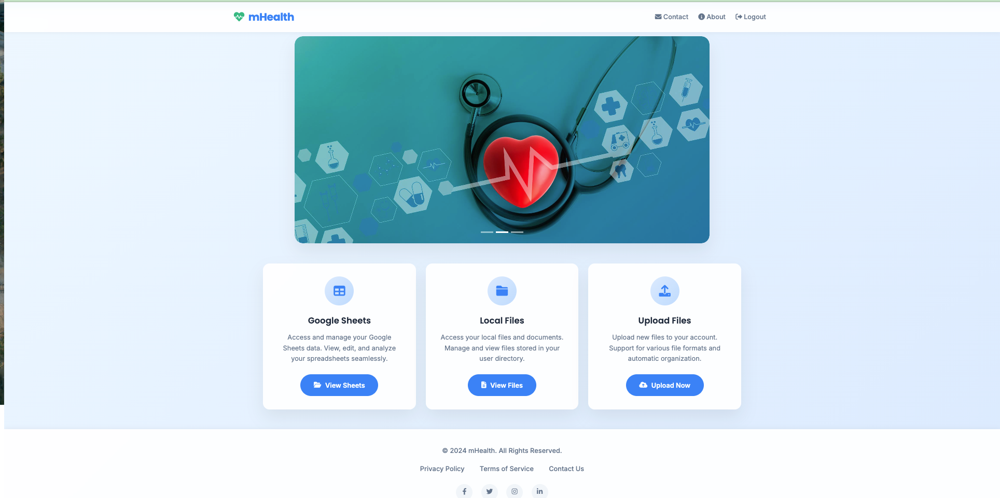

# mHealth – Multi‑Signal Health Monitoring Platform

> **Physiological signals · Secure by design · Research‑grade analytics**

mHealth is a full-stack, research-grade health data platform that allows the seamless ingestion, storage, analysis, and visualization of physiological signals like PPG (heart activity), GSR (stress level), and actigraphy (motion/sleep cycle). Built at IIIT-Delhi, it combines custom hardware with a Django-powered backend and interactive dashboards. It enables researchers and clinicians to extract meaningful insights from raw biosensor data while ensuring user consent, data security, and medical compliance.

---

## 🧾 Summary

- Real-time sensor data is streamed to the backend via Wi-Fi from wearable hardware.
- A user-friendly web interface allows onboarding, consent handling, and data uploads.
- Users can visualize their signals through interactive graphs and download standardized HL7 medical data.
- The system includes optimizations for large-scale datasets (200,000+ rows) and complies with HIPAA and GDPR.
- Secure architecture includes AES encryption, TLS transmission, role-based access, and consent gating.

---

## 🖥️ Application Pages in Detail
### 📝 Welcome Page

- Greets users with a "Welcome to mHealth" message emphasizing control over health data
- Highlights features like tracking progress, secure data encryption, and mobile access
- Provides "Login" and "Sign Up" buttons for user onboarding
- Includes a visual of a doctor with a globe and stethoscope symbolizing global health care
 
---

### 🏠 Home Page

After login, users land on the central dashboard or "Home Page." This is a control hub that:
- Displays a summary of uploaded files with timestamps
- Provides shortcuts to upload new data
- Links to PPG, GSR, actigraphy graphs, HL7 export, and file viewing options
- Presents user-specific views (based on role — Admin, Researcher, User)
 
---

### 🔐 Login and Sign-Up Page

- Sign-up form that enforces strong passwords and validates unique usernames
- Login form that verifies credentials securely via Django authentication
- Redirect to consent form on first sign-up 


---

### 🔑 Reset Your Password Page

- Provides a password reset interface with an email input field
- Allows users to request a reset link sent to their email for secure password recovery
- Features a "Send Reset Link" button for submission
 
---


### 📤 Uploaded Google Sheets Page

- Lists uploaded Google Sheets with timestamps and a "View Data" button for each file
- Organizes files by upload date, allowing users to access and analyze data from various sheets
- Offers options to view and manage Google Sheets data seamlessly
 
---
### 📋 Raw Data Sheet Viewer Page
- Tabular view of uploaded data
- Search and scroll through original values

---
### 🗂️ Personal Health Files Page

- Displays a list of uploaded CSV files with creation/modification dates, file types, and sizes
- Offers actions like "View Data" and "Download HL7" for each file
- Allows users to manage their health data efficiently
 
---
### 📋 File Detail View Page

- Displays detailed information about a selected file (e.g., processed_data.csv, latest.csv)
- Offers options to download HL7 data, view PPG, GSR, or actigraphy signals, and access a complete view
- Includes a "Back to Files" button for navigation
 
---


### 📊 PPG Data Visualization Page

- Provides day-wise photoplethysmogram (PPG) data trends
- Includes interactive graphs with zoom and pan capabilities, showing heart rate metrics (e.g., average heart rate of 88.8 BPM)
- Supports batch rendering for performance optimization
 
---

### 📊 GSR Data Visualization Page

- Displays Galvanic Skin Response (GSR) data trends from uploaded CSV files
- Features an interactive graph with filter options (e.g., 12:00 AM to 11:59 PM) and average GSR values (e.g., 38.99 µS)
- Allows detailed analysis of stress response data
 
---

### 📊 Actigraphy Visualization Page

- Offers multiple visualization options: Weekly Overview, Daily View, and Statistics
- Weekly Overview provides a comprehensive view of actigraphy data with a "View Weekly Data" button
- Daily View allows selection of a specific day for detailed acceleration and movement patterns
- Statistics provides summary statistics and comparisons across all recorded days
 
---


### 📊 Compact -Physiological Data Visualization Page

- Provides multi-day analysis of GSR, PPG, and Actigraphy data from a single CSV file
- Features an interactive graph with toggle series and time filter options
- Displays average values for GSR: 38.99 µS, PPG: 0.81, Actigraphy: 16920.19 m/s²
 
---
### 📄 HL7 Data View Page
- Shows standardized medical data format
- Includes PID and OBX segments
- Timestamped entries for clinical use
 
---

### 🗂️ User Health Files Management Page

- Lists health files associated with multiple users (e.g., nootan, vipul, krish) with options to view data
- Provides a centralized view for managing user-specific health files
 
---

### 🗂️ Admin Health Files Management Page

- Allows admins to view and manage health files for all users, including detailed file lists with timestamps and actions
- Provides options to access user-specific data (e.g., nootan, vipul, krish) with "View Data" and "Download HL7" buttons
- Includes an admin dashboard to oversee multi-user activity and file integrity
 
---
### 📋 Admin File Detail View Page

- Allows admins to view detailed file information for any user’s files (e.g., processed_data.csv, latest.csv)
- Provides admin-specific actions like "View User Data", "Download HL7", and "Delete File"
- Includes a "Return to Admin Dashboard" button for navigation
 
---

## ⚙️ Installation and Setup

### 1. Clone the Repository
```bash
git clone https://github.com/YourUser/mhealth-django.git
cd mhealth-django
```

### 2. Create Virtual Environment and Install Dependencies
```bash
python -m venv venv
source venv/bin/activate  # On Windows: venv\Scripts\activate
pip install -r requirements.txt
```

### 3. Set Up the Database

Edit `mhealth/settings.py`:
```python
DATABASES = {
    "default": {
        "ENGINE": "django.db.backends.mysql",  # or "sqlite3"
        "NAME": "mhealth_db",
        "USER": "your_db_user",
        "PASSWORD": "your_db_password",
        "HOST": "localhost",
        "PORT": "3306",
    }
}
```

Or keep the default SQLite database for quick local testing.

### 4. Apply Migrations
```bash
python manage.py migrate
```

### 5. Create Superuser
```bash
python manage.py createsuperuser
```

Follow the prompts to set username and password.

### 6. Run the Development Server
```bash
python manage.py runserver
```

Open in your browser: [http://127.0.0.1:8000/](http://127.0.0.1:8000/)


