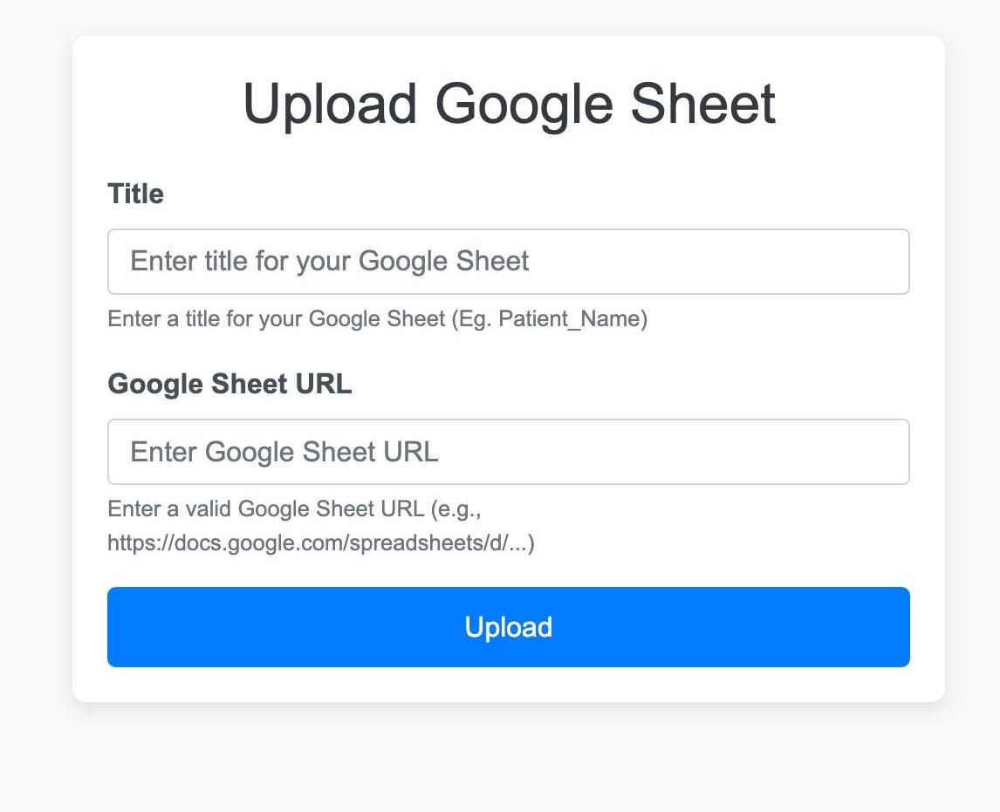

# mHealth - PPG-based Health Monitoring System

## Home Page

### 🏠 **Home Page**
- Upon logging in, users will be redirected to the **Home Page**.
   
- The **Home Page** provides an overview of the system's available functionalities, including access to file uploads, file viewing, and data visualization.
---

### 🚀 **User Login and Signup**
- **Sign Up**: Users must sign up with a **unique username** and **password**.
- **Login**: Returning users can log in to access their data.
- **Post-signup Action**: After signing up, users must fill the **consent form** before proceeding to the home page.

   
     
   *Login and Signup Page*

---

### 📑 **Consent Form**
- The **consent form** is mandatory. Users cannot proceed to other pages unless the form is filled.

     
   *Consent Form Page*

---

### 📂 **Uploading Files**
- After signing up and accepting the consent form, users can upload data files containing **sensor recordings**.
- Each file must have a **file name** and a **sheet link** for the user to reference.

     
   *File Upload Page*

---

### 🗂️ **Viewing Files**
- On the **Home Page**, users can view all **uploaded files**, with **timestamps** and **file names** displayed.

     
   *View Uploaded Files Page*

---

### ⚙️ **File Actions**
For each uploaded file, users can:
- **⬇️ Download HL7**: Download the file in **HL7 format**.
- **📊 View PPG**: View a **graphical representation** of the **PPG data**.
- **📄 View File**: View the **raw file contents**.
- **🔍 View HL7**: View the data in **HL7 format**.

     
   *File Actions Page*

---

### 📉 **PPG Graph**
- When users click on **View PPG**, a graph is generated using the **PPG data**.
- The graph displays **PPG readings** over time, with separate graphs for each day.

     
   *PPG Graph Display*

---

### 🔎 **View HL7 Data**
- Users can view the **HL7 format data** for each uploaded file.
- This provides a detailed breakdown of the health metrics in HL7 format.

     
   *View HL7 Data Page*

---

### ⬇️ **Download HL7**
- Users can download the **HL7** formatted data file for further analysis or storage.

     
   *Download HL7 Page*

---

### 📄 **View Sheet Data**
- Users can view the **raw data sheet** of the uploaded file in tabular format, offering transparency of the data.

     
   *View Sheet Data Page*

---

## Requirements

- Python 3.x
- Django 3.x or later
- MySQL or SQLite for database
- Required Libraries: `numpy`, `matplotlib`, `pandas`, etc.

---

## Installation and Setup

Follow the instructions provided earlier for **cloning the repository**, **installing dependencies**, **setting up the database**, and running the development server.

---

By integrating the **Home Page** as a starting point after login, it serves as a hub for users to access various functionalities like uploading files, viewing data, and downloading HL7-formatted reports. This updated structure enhances usability and ensures a streamlined user experience.

---

### Step 1: Clone the Repository

Clone the repository to your local machine:
```bash
git clone https://github.com/Vipul0127/mhealth-django.git
cd mhealth-django
```

### Step 2: Install Dependencies

Create a virtual environment and install required dependencies:
```bash
python3 -m venv venv
source venv/bin/activate  # On Windows, use `venv\Scripts\activate`
pip install -r requirements.txt
```

### Step 3: Set Up the Database

Create a database in MySQL or use the default SQLite database.
Update the database settings in `settings.py`:
```python
DATABASES = {
    'default': {
        'ENGINE': 'django.db.backends.mysql',  # Or 'sqlite3' for SQLite
        'NAME': 'mhealth_db',
        'USER': 'your-database-user',
        'PASSWORD': 'your-database-password',
        'HOST': 'localhost',
        'PORT': '3306',
    }
}
```

### Step 4: Migrate the Database

Run the database migrations to create tables:
```bash
python manage.py migrate
```

### Step 5: Create a Superuser

Create a superuser to access the Django admin interface:
```bash
python manage.py createsuperuser
```

### Step 6: Run the Development Server

Start the server:
```bash
python manage.py runserver
```

Visit `http://127.0.0.1:8000/` in your browser.
```


